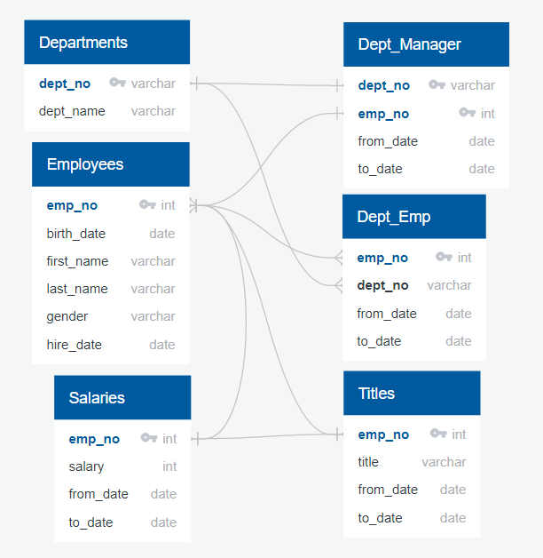
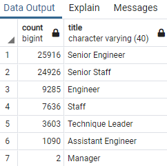

# Human Resources Database Analysis

## Overview:
### Purpose:
Used SQL to analyze a hypothetical Company's HR database in anticipation of a potential wave of retirements.

### Database Diagram:
Generated using [QuickDBD](https://app.quickdatabasediagrams.com/#/):

## Results:

### The Company has Excellent Internal Mobility
When we filtered the Employees Table for employees with birth dates between 1952 and 1955, we initially came up with a list of over 130k employees. Upon further review, we noticed that this number was inflated as employees are listed in this table once for each title that they have held at the Company. After filtering for unique employee numbers (and removing terminated employees), we narrowed the list down to approx 72k employees who were at risk of retiring.

### Retiring Employees Primarily Hold Senior Titles
We can see that out of the 72k+ employees about to retire, over 70% hold a 'Senior' title (close to 17% of the Company's 300k employee workforce), which can be very concerning as lower level employees may need to pick up tasks that they are unfamilar with.

Using SQL to query the count of Retiring Employees by Job Title, we get the following:

### Mentorship Program 
#### Mentorship Program May Need to be Expanded
By filtering th employee table for employees born in 1965, we see that ~1.5k employees would be eligible to be a Mentor. However, the current Program's parameters do not factor in each Employee's tenure at the Company or their current Job titles. 

#### Mentorship Program Needs Stricter Guidelines
When we drill down into the mentorship eligibility table, we see that the largest job title count is "Staff" (over 0.4k or approx 27% of the mentor pool), and that "Senior" level titles only make up approx 0.7k (~45% of the mentor pool). This is concerning as we may end up with a "blind-leading-the-blind" scenario.

## Summary:
### High-Level findings:
1. Based on the analysis, up to approximately 72 thousand jobs may be vacated as the "silver tsunami" begins to make an impact.
2. Based on the Analysis, there does not appear to be enough qualified, retirement-ready employees to mentor the next generation of workers.

### More Analysis needed:
In order to better assess the Company's workforce, we should make some additional queries / tables from the Employee Database. Two additional queries that I would recommend looking at include:
1. I would be interested in looking at the distribution of job titles in each Department, to see whether certain departments will be more heavily impacted by the "silver tsunami" (i.e. higher distribution of "Senior" level employees reaching retirement age).
2. I would like to expand the birth date filter for mentorship elibility, and additionally add a requirement that the employee has been working at the Company for over a certain time requirement / tenure, and that they hold at least a 'Senior' level job title. This will hopefully increase the size of the mentorship eligibility pool, as well as the quality of the available mentors.
